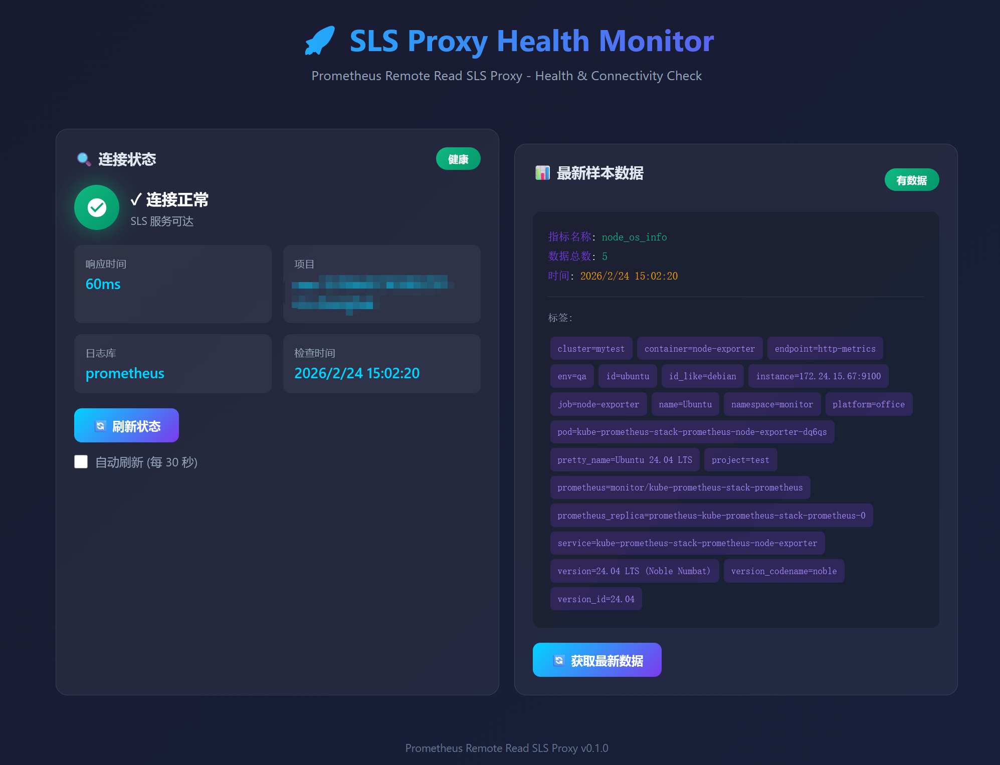

# Prometheus Remote Read SLS Proxy

一个支持 Prometheus Remote Read 协议的代理，可以从阿里云 SLS (日志服务) 读取指标数据并返回给 Prometheus 和 Grafana。
(grafana不推荐配置prometheus源，默认grafana请求prometheus的时候会读取本地，即使配置了remote_read)

## 功能特性

- ✅ 支持 Prometheus Remote Read API (`/api/v1/read`)
- ✅ 支持 Prometheus 查询 API (`/api/v1/query`, `/api/v1/query_range`)
- ✅ 支持 Prometheus 标签 API (`/api/v1/label/*/values`, `/api/v1/labels`, `/api/v1/series`)
- ✅ 从阿里云 SLS MetricStore 读取指标数据
- ✅ 支持大数据量分页查询
- ✅ 支持并发请求处理
- ✅ 支持环境变量配置
- ✅ 支持 TLS/HTTPS
- ✅ 支持 Docker 部署
- ✅ 支持可配置的日志级别

## 快速开始

### 1. 配置修改

编辑 `config.yaml` 文件，配置 SLS 连接信息：

```yaml
server:
  host: "0.0.0.0"
  port: 8080

sls:
  endpoint: "cn-shanghai.log.aliyuncs.com"
  access_key_id: "your-access-key-id"
  access_key_secret: "your-access-key-secret"
  project: "your-project-name"
  logstore: "your-metricstore-name"
  query: "* | where __name__ != ''"
  max_results: 10000
```

或者使用环境变量：

```bash
export SLS_ENDPOINT="cn-shanghai.log.aliyuncs.com"
export SLS_ACCESS_KEY_ID="your-access-key-id"
export SLS_ACCESS_KEY_SECRET="your-access-key-secret"
export SLS_PROJECT="your-project-name"
export SLS_LOGSTORE="your-metricstore-name"
```

### 2. 本地运行

```bash
# 构建
make build

# 运行
./prometheus-remoteread-sls -config config.yaml
```

### 3. Docker 部署

#### 使用 Docker Compose（推荐）

```bash
# 启动服务
docker-compose up -d

# 查看日志
docker-compose logs -f

# 停止服务
docker-compose down
```

#### 使用 Docker 命令

```bash
# 构建镜像
docker build -t prometheus-remoteread-sls .

# 运行容器
docker run -d \
  -p 8080:8080 \
  -v $(pwd)/config.yaml:/app/config.yaml \
  prometheus-remoteread-sls
```

#### Docker Compose 配置示例

```yaml
version: '3.8'

services:
  prometheus-remoteread-sls:
    build: .
    ports:
      - "8080:8080"
    volumes:
      - ./config.yaml:/app/config.yaml
    environment:
      - SLS_ENDPOINT=cn-shanghai.log.aliyuncs.com
      - SLS_ACCESS_KEY_ID=your-access-key-id
      - SLS_ACCESS_KEY_SECRET=your-access-key-secret
      - SLS_PROJECT=your-project-name
      - SLS_LOGSTORE=your-metricstore-name
    restart: unless-stopped
```

## Grafana 配置

### 方式一：使用本服务作为 Prometheus 数据源（推荐）

在 Grafana 中添加 Prometheus 数据源，URL 填写本服务的地址：

```
URL: http://your-server:8080
```

Grafana 会自动使用以下 API：

- `/api/v1/query` - 即时查询
- `/api/v1/query_range` - 范围查询
- `/api/v1/label/*/values` - 标签值
- `/api/v1/labels` - 标签列表

### 方式二：直接使用 SLS 作为 Prometheus 数据源

如果需要直接连接阿里云 SLS MetricStore，可以在 Grafana 中添加 Prometheus 数据源，使用 SLS 的 Prometheus 兼容接口：

**配置参数：**

| 参数 | 说明 | 示例值 |
|------|------|--------|
| URL | SLS MetricStore 的 Prometheus 兼容接口 | `https://{project}.{endpoint}/prometheus/{project}/{metricstore}` |

**URL 格式：**

```
https://{project}.{sls-endpoint}/prometheus/{project}/{metricstore}
```

**示例：**

- Project: `prometheus-test`
- Endpoint: `cn-hangzhou.log.aliyuncs.com`
- MetricStore: `prometheus`

则 URL 为：

```
https://prometheus-test.cn-hangzhou.log.aliyuncs.com/prometheus/prometheus-test/prometheus
```

**认证方式：**

- 选择 "Basic Auth"
- 输入阿里云 AccessKey ID 和 AccessKey Secret

### 方式三：使用 Prometheus Remote Read

在 Prometheus 配置中添加 remote_read：

```yaml
remote_read:
  - url: "http://your-server:8080/api/v1/read"
```

### 方式四：使用 SLS Grafana 插件

阿里云还提供了专门的 Grafana 数据源插件，可以直接连接 SLS：

1. **安装插件**
   
   ```bash
   wget https://github.com/aliyun/aliyun-log-grafana-datasource-plugin/archive/refs/heads/master.zip
   unzip master.zip -d /var/lib/grafana/plugins
   ```
2. **在 Grafana 中添加数据源**
   
   - 选择 "Aliyun Log Service" 插件
   - 配置参数：
     - **Endpoint**: `cn-shanghai.log.aliyuncs.com`
     - **Project**: 您的 Project 名称
     - **Logstore**: 您的 Logstore 名称
     - 输入阿里云 AccessKey

## 日志配置

在 `config.yaml` 中配置日志级别：

```yaml
logging:
  level: "info"  # 可选值: debug, info, warn, error
  format: "standard"
```

- `debug` - 显示所有日志（包括详细调试信息）
- `info` - 只显示重要信息（启动、错误、请求摘要）
- `warn` - 只显示警告和错误
- `error` - 只显示错误

## API 接口

### Prometheus Remote Read

| 接口 | 说明 |
|------|------|
| `GET /api/v1/read` | Prometheus Remote Read API |

### Prometheus Query API

| 接口 | 说明 |
|------|------|
| `GET /api/v1/query` | 即时查询 |
| `GET /api/v1/query_range` | 范围查询 |
| `GET /api/v1/label/{name}/values` | 获取标签值 |
| `GET /api/v1/labels` | 获取所有标签 |
| `GET /api/v1/series` | 获取序列 |
| `GET /api/v1/status/buildinfo` | 获取构建信息 |
| `GET /api/v1/query_exemplars` | 查询样例 |

### 健康检查

| 接口 | 说明 |
|------|------|
| `GET /health` | 健康检查 |
| `GET /metrics` | Prometheus 格式指标 |



## SLS 日志格式

SLS 中的日志需要遵循以下格式，以便正确解析为 Prometheus 指标：

```json
{
  "__time__": 1699958400,
  "__name__": "http_requests_total",
  "__value__": 100.0,
  "__labels__": "{\"method\":\"GET\",\"status\":\"200\"}",
  "instance": "server01",
  "job": "web"
}
```

或者使用单独的标签字段：

```json
{
  "__time__": 1699958400,
  "__name__": "http_requests_total",
  "__value__": 100.0,
  "method": "GET",
  "status": "200",
  "instance": "server01",
  "job": "web"
}
```

**注意：**

- `__time__` 字段为 Unix 时间戳（秒）
- `__name__` 为指标名称
- `__value__` 为指标值
- `__labels__` 可选，用于存储额外的标签（JSON 格式）

## 相关文档

- [阿里云 SLS 文档](https://help.aliyun.com/zh/sls)
- [SLS 时序数据导入 Grafana](https://help.aliyun.com/zh/sls/send-time-series-data-from-log-service-to-grafana)
- [Prometheus Remote Read API](https://prometheus.io/docs/prometheus/latest/querying/api/#remote-read-api)
- [Prometheus Query API](https://prometheus.io/docs/prometheus/latest/querying/api/)

## 配置说明

### Server 配置

| 参数 | 说明 | 默认值 |
|------|------|--------|
| `host` | 服务器监听地址 | `0.0.0.0` |
| `port` | 服务器监听端口 | `8080` |
| `read_timeout` | 读取超时时间 | `300s` |
| `write_timeout` | 写入超时时间 | `300s` |
| `idle_timeout` | 空闲连接超时 | `120s` |

### SLS 配置

| 参数 | 说明 | 默认值 |
|------|------|--------|
| `endpoint` | SLS 服务端点（如 `cn-shanghai.log.aliyuncs.com`） | - |
| `access_key_id` | 阿里云 AccessKey ID | - |
| `access_key_secret` | 阿里云 AccessKey Secret | - |
| `security_token` | 临时安全令牌（可选） | - |
| `project` | SLS Project 名称 | - |
| `logstore` | SLS Logstore/MetricStore 名称 | - |

### Remote Read 配置

| 参数 | 说明 | 默认值 |
|------|------|--------|
| `concurrent_requests` | 并发请求数 | `5` |
| `query_timeout` | 查询超时时间 | `180s` |
| `partial_response` | 是否允许部分响应 | `false` |
| `max_samples` | 最大采样点数 | `1000000` |

### Logging 配置

| 参数 | 说明 | 默认值 |
|------|------|--------|
| `level` | 日志级别 (debug/info/warn/error) | `debug` |
| `format` | 日志格式 (standard/json) | `standard` |

## 开发

### 运行测试

```bash
make test
```

### 代码格式

```bash
make fmt
```

### 构建二进制

```bash
make build
```

## 许可证

MIT License

